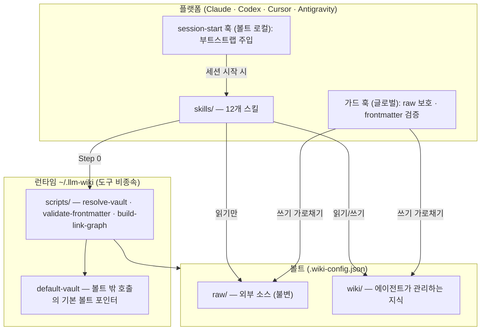
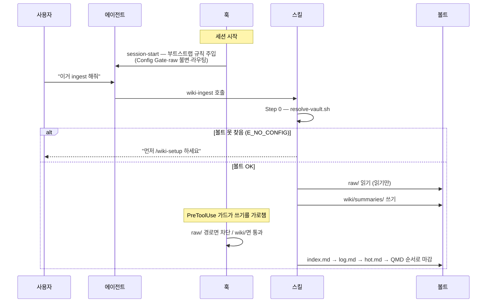
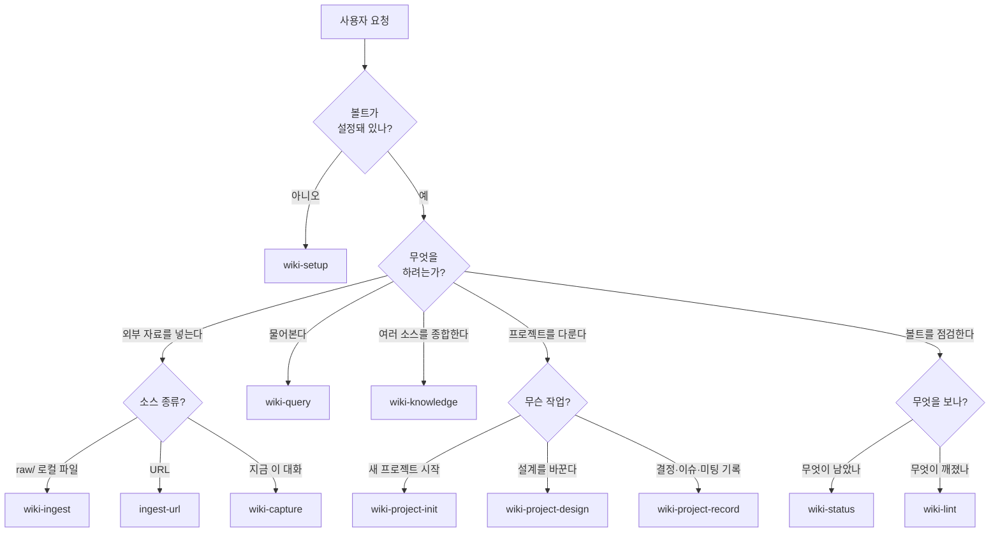
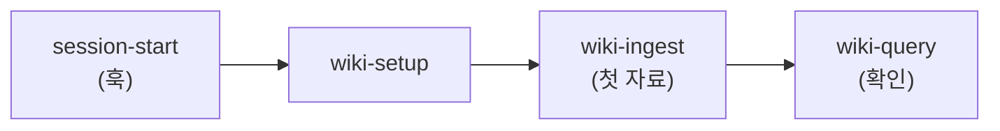
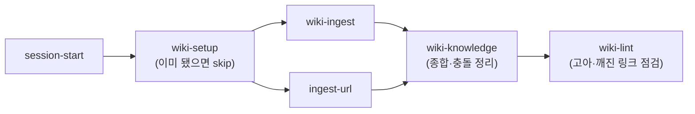
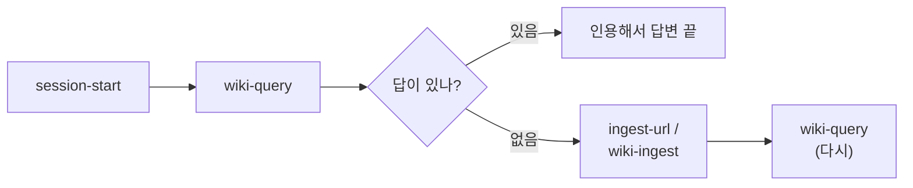
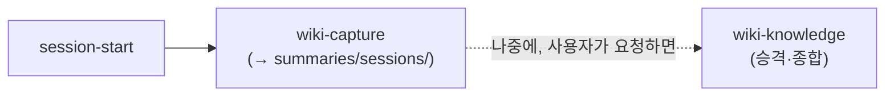
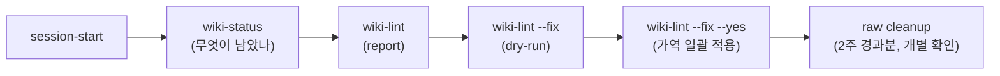
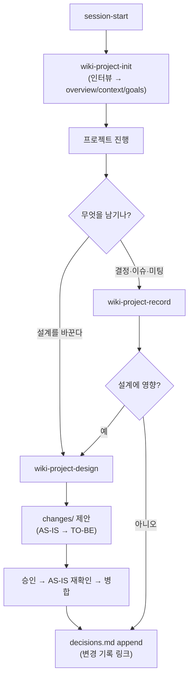
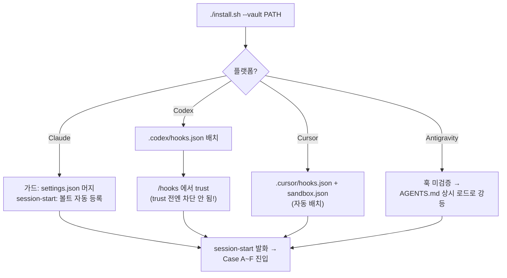

# LLM Wiki Harness — 사용 Best Practice

실제로 어떤 순서로 스킬을 호출하는지를 **그림 + 표**로 정리한다.
핵심은 하나다: **모든 흐름은 `session-start` 훅이 부트스트랩을 주입한 뒤 시작하고, 모든 쓰기는 Step 0 Config Gate를 통과한다.** 그 위에서 케이스마다 스킬 순서가 달라진다.

- 카탈로그·설치는 [README](../README.md), 규칙의 근거는 [spec.md](specs/spec.md)·[distribution-design.md](specs/distribution-design.md) 참조.

---

## 1. 큰 그림 — 3개 레이어

쓰기 한 번이 거치는 구조. 런타임은 도구 비종속, 플랫폼은 훅을 건다, 볼트는 데이터를 담는다.

| 레이어 | 위치 | 역할 | 전역/로컬 |
|---|---|---|---|
| 런타임 | `~/.llm-wiki/` | 결정론적 스크립트 + 기본 볼트 포인터 | 머신 1개당 1개 |
| 가드 훅 | `~/.claude/hooks` 등 | `raw/` 쓰기 차단·frontmatter 검증 | **글로벌** (비볼트에선 no-op) |
| session-start 훅 | `{vault}/.claude` 등 | 부트스트랩 규칙 주입 | **볼트 로컬** (볼트 밖 세션엔 미주입) |
| 볼트 | 임의 디렉토리 | `raw/`(불변) + `wiki/`(관리 대상) | 여러 개 가능 |

---

## 2. 한 세션의 생애 — 훅이 먼저, 스킬은 그 위에서

스킬을 직접 호출하기 **전에** 두 가지가 자동으로 일어난다: ① session-start가 규칙을 주입하고, ② 쓰기를 시도하면 가드 훅이 가로챈다.

**불변 순서 두 가지** (케이스가 달라도 항상 같다):

| 순서 | 내용 | 강제 주체 |
|---|---|---|
| 모든 작업 시작 | `session-start` 주입 → 스킬 호출 → **Step 0 Config Gate** | 훅 + 각 스킬 |
| 모든 쓰기 마감 | 페이지 → `index.md` → `log.md` → `hot.md` → QMD refresh | 쓰기 스킬 |

---

## 3. 어떤 스킬을 부를까 — 라우팅 결정 트리

매 요청마다 머릿속에서 이 트리를 탄다. (부트스트랩 스킬 `using-llm-wiki`가 이 표를 들고 있다.)

| 분기 | 신호 단어 | 스킬 |
|---|---|---|
| 설정 안 됨 | "처음", "초기화", `E_NO_CONFIG` | `wiki-setup` |
| 로컬 파일 적재 | "이 파일/PDF ingest" | `wiki-ingest` |
| URL 적재 | "이 링크 정리" | `ingest-url` |
| 대화 캡처 | "방금 우리 얘기 저장" | `wiki-capture` |
| 질문 | "~가 뭐였지?", "어디 적혀있어?" | `wiki-query` |
| 종합 | "흩어진 거 묶어서 정리" | `wiki-knowledge` |
| 프로젝트 시작 | "새 프로젝트 X" | `wiki-project-init` |
| 설계 변경 | "아키텍처/도메인 바꾸자" | `wiki-project-design` |
| 기록 | "이 결정/이슈 남겨" | `wiki-project-record` |
| 진행 상황 | "뭐 남았어?" | `wiki-status` |
| 감사 | "깨진 링크/모순 점검" | `wiki-lint` |

---

## 4. 케이스별 흐름 — 순서는 케이스마다 다르다

같은 12개 스킬이지만, 상황에 따라 **진입점과 순서가 완전히 달라진다.** 7가지 대표 케이스.

### Case A — 그린필드: 빈 볼트에서 처음 시작

> 설정 → 첫 자료 → 질문. 가장 교과서적인 순서.

| 단계 | 스킬 | 산출물 |
|---|---|---|
| 1 | `wiki-setup` | `.wiki-config.json`, `wiki/` 골격, QMD 컬렉션 |
| 2 | `wiki-ingest` | `summaries/` 첫 페이지 + concepts/entities |
| 3 | `wiki-query` | 잘 들어갔는지 검색으로 확인 |

---

### Case B — 자료 대량 적재 후 종합

> 여러 소스를 쌓고 **마지막에** 종합·감사. ingest가 반복되고 knowledge가 뒤에 온다.

| 단계 | 스킬 | 포인트 |
|---|---|---|
| 1..n | `wiki-ingest` / `ingest-url` | 소스별 1페이지, 충실한 요약만 (해석 X) |
| n+1 | `wiki-knowledge` | summaries를 증류 → 심층 페이지. 충돌은 `## Conflicts`로 |
| n+2 | `wiki-lint` | 누적된 고아/깨진 링크 일괄 점검 |

> ⚠️ `knowledge/`는 ingest가 자동 생성하지 않는다 — 항상 `wiki-knowledge`로 **의도적으로** 만든다.

---

### Case C — 질문이 먼저, 없으면 그때 적재 (역방향)

> Case A와 **순서가 거꾸로다.** 일단 물어보고, 답이 없으면 그 자리에서 채운다.

| 분기 | 행동 |
|---|---|
| wiki에 있음 | 페이지 인용해 답변. 끝 (쓰기 없음) |
| wiki에 없음 | **"없다"고 명시** → 소스 적재 → 재질의 |

> `wiki-query`는 읽기 전용(단 `log.md`에 질의 1줄만 append). 답을 지어내지 않는다.

---

### Case D — 대화 중 발견을 캡처, 나중에 승격

> 적재가 아니라 **지금 이 대화**가 소스. 캡처는 즉시, knowledge 승격은 나중·명시 요청 시만.

| 단계 | 스킬 | 비고 |
|---|---|---|
| 1 | `wiki-capture` | `summaries/sessions/`에 저장, `base_confidence: 0.42` 고정, 비밀정보 마스킹 |
| 2 (선택) | `wiki-knowledge` | 세션 캡처는 자동 승격 안 됨 — **사용자가 명시 요청할 때만** |

---

### Case E — 유지보수 사이클: 상태 → 감사 → 수정 → 정리

> "무엇이 남았나"(status)와 "무엇이 깨졌나"(lint)는 **다른 스킬**이다. 점검부터 정리까지 4단계.

| 단계 | 명령 | 안전장치 |
|---|---|---|
| 1 | `wiki-status` | 읽기 전용. pending·recent·token footprint |
| 2 | `wiki-lint` | 17개 검사 보고만 |
| 3 | `wiki-lint --fix` | **기본 dry-run** — 무엇을 고칠지 먼저 보여줌 |
| 4 | `wiki-lint --fix --yes` | 가역 변경만 일괄. frontmatter는 append-only |
| 5 | raw cleanup | `--yes`여도 **raw 삭제는 항상 개별 확인** |

---

### Case F — 프로젝트 운영: 시작 → 설계 진화 → 기록

> `raw/` 없이도 돌아가는 트랙. 설계 변경은 곧장 고치지 않고 **change proposal**을 경유한다.

| 작업 | 스킬 | 규칙 |
|---|---|---|
| 시작 | `wiki-project-init` | 인터뷰, `[NEEDS CLARIFICATION]` ≤5, non-goals 필수 |
| 설계 진화 | `wiki-project-design` | architecture/domain/conventions 의미 변경은 **proposal 경유** |
| 기록 | `wiki-project-record` | 설계-영향 결정은 design으로 라우팅, 독립 결정만 `decisions.md` 직행 |

> `decisions.md`·`backlog.md`는 append-only. `troubleshooting/`은 resolved 후 불변.

---

### Case G — 멀티플랫폼 부트스트랩: 설치가 먼저, 스킬은 그 다음

> Codex·Cursor는 **스킬을 부르기 전에** 설치/신뢰(trust) 단계가 추가된다. 순서의 앞단이 다르다.

| 플랫폼 | 스킬 호출 전 추가 단계 | 함정 |
|---|---|---|
| Claude | settings.json에 가드 머지 (session-start는 자동) | — |
| **Codex** | hooks.json 배치 후 **`/hooks` trust** | trust 안 하면 가드가 차단 안 함 |
| Cursor | `--vault`가 자동 배치 | Cloud Agent는 sessionStart 미지원 → 로컬 Agent 사용 |
| Antigravity | 훅 없이 AGENTS.md 지침에만 의존 | raw/ 편집을 기계가 못 막음 — **수동 주의** |

---

## 5. 안티패턴 — 이렇게 하지 말 것

| 안티패턴 | 왜 문제 | 대신 |
|---|---|---|
| `raw/` 직접 수정 | 소스 무결성 깨짐 (훅이 차단) | 볼트 밖에서 고쳐 **재ingest** |
| `knowledge/`를 ingest로 자동 생성 | 검증 안 된 해석이 공식 지식에 섞임 | `wiki-knowledge`로 의도적 종합 |
| 충돌 시 한쪽 임의 채택 | 이력 소실·편향 | `## Conflicts` open 항목 → 사용자 판단 |
| 설계 문서를 직접 덮어쓰기 | 변경 근거가 사라짐 | `changes/` proposal 경유 |
| QMD 검색 결과를 그대로 인용 | discovery 전용, 본문과 불일치 가능 | 항상 파일 본문에서 재확인 |
| status로 품질 보고 / lint로 진행도 보고 | 두 스킬의 경계 혼동 | status=남은 일, lint=깨진 것 |
| Config Gate 건너뛰고 쓰기 | 엉뚱한 볼트에 씀 | 모든 스킬은 Step 0부터 |

---

## 6. 빠른 참조

| 상황 | 진입 스킬 | 그 다음 |
|---|---|---|
| 처음 시작 | `wiki-setup` | ingest → query |
| 파일/URL/대화 넣기 | `wiki-ingest`·`ingest-url`·`wiki-capture` | (대량이면) knowledge → lint |
| 뭔가 물어보기 | `wiki-query` | 없으면 ingest 후 재질의 |
| 흩어진 지식 묶기 | `wiki-knowledge` | lint |
| 볼트 점검 | `wiki-status`(남은 일) / `wiki-lint`(깨진 것) | `--fix` → raw cleanup |
| 프로젝트 | `wiki-project-init` | design(proposal) / record |
| 에러 코드 | — | [트러블슈팅](troubleshooting.md) |

> 모든 흐름의 공통 전제: **session-start가 규칙을 깔고 → 스킬이 Step 0로 볼트를 잡고 → 쓰기는 index→log→hot→QMD로 마감한다.**
