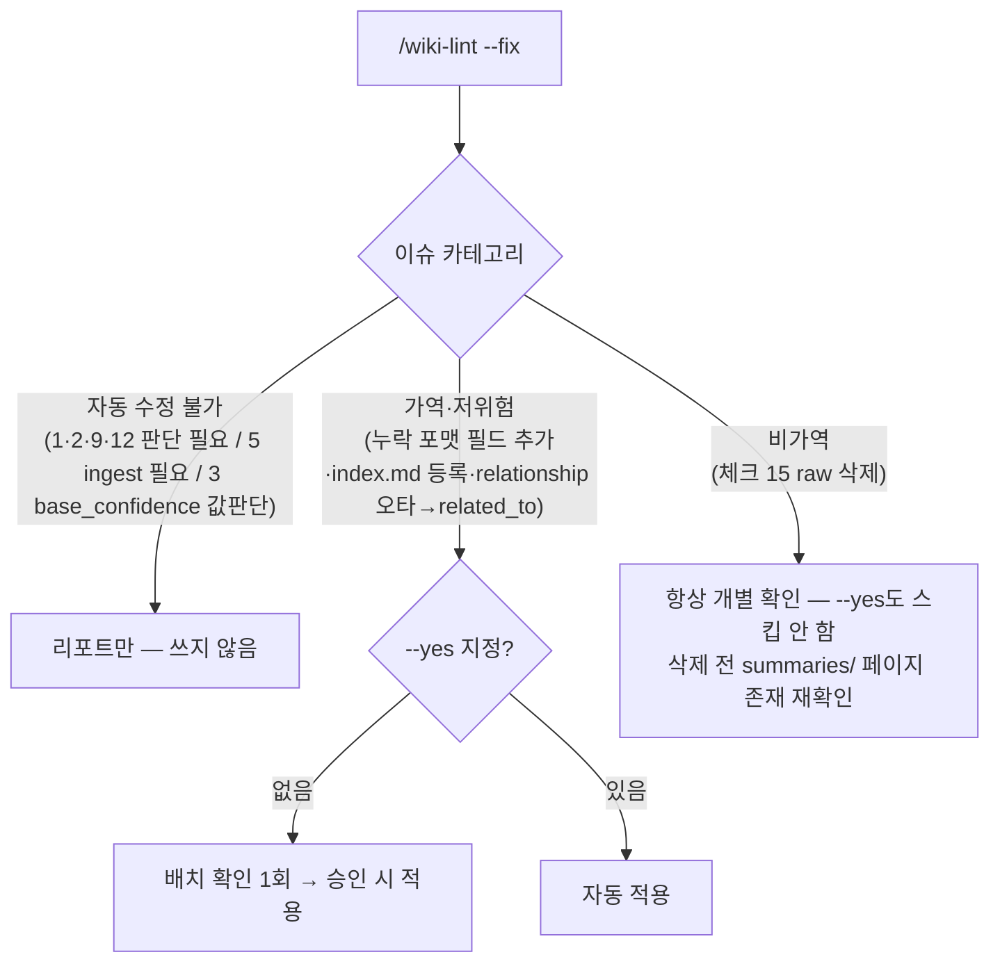

# wiki-lint

## 개요
볼트를 감사하고, 요청 시(`--fix`) 기계적으로 수정 가능한 이슈를 고친다. 17개 체크를 severity별로 그룹화해 리포트한다.

## wiki-status와의 경계
lint는 **"무엇이 깨졌나"**(구조적 이슈: 고아, 깨진 링크, 포맷 오류, 충돌, PII, drift)에 답한다. **"무엇이 남았나"**(ingest 대기, 최근 활동, 토큰 풋프린트)는 `wiki-status`의 영역이며 여기서 다루지 않는다. 두 스킬이 겹치는 항목(체크 15 raw_deletable, 체크 17 manifest_integrity)에서도 **판단·수정은 lint가 전담**하고, status는 카운트/목록만 보고한다.

## Config Gate
`using-llm-wiki` 참조. 먼저 통과시킨다.

**Report-only 실행은 read-only** (`log.md`에 LINT 줄만 추가됨). 페이지를 쓰는 유일한 모드는 `--fix`다.

## 정본 스크립트를 사용 — 재발명 금지
결정론적 체크는 **단일 코드 출처**에서 나온다 (validator 훅이 쓰는 것과 동일한 스크립트이므로 결과가 절대 드리프트하지 않음). `rg`/grep 링크 스캔을 손수 짜지 마라:
- `~/.llm-wiki/scripts/build-link-graph.sh <WIKI_DIR>` → **O(N) 단일 패스**로 고아, 깨진 링크, 개념 갭, 관계 target/self 이슈 산출 (체크 1, 2, 9, 12). 파일별 grep(O(N×M)) 금지.
- `~/.llm-wiki/scripts/validate-frontmatter.sh <file>` → 페이지별 클래스 인식 frontmatter 체크 (체크 3). 페이지 전반에 실행; 문서 클래스 규칙을 적용한다 (원장 파일 면제, changes/troubleshooting enum).

**스캔 대상 제외:** `wiki/index.md`, `wiki/log.md`, `wiki/hot.md` — 17개 체크 전체에서 스캔·계수 대상이 아니다. hot.md는 쓰기 스킬이 자동 갱신하므로 lint가 검증하지 않는다.

## 17개 체크 표
severity별로 그룹화해 출력한다 (🔴 ERROR → 🟡 REVIEW → ℹ️ SOFT). 각 `#`/`key`는 log 필드명과 1:1 매칭 — 자동 파싱 가능. 밀집한 체크(11·13·15·16)는 표 아래 상세 절에서 풀어 쓴다.

| # | key | check | sev | source |
|--|--|--|--|--|
|1|orphans|inbound 링크 0건 (index/log/hot 제외)|🟡|graph|
|2|broken_links|`[[link]]` 대상 파일 없음|🟡|graph|
|3|format_errors|클래스별 필수 키 누락 · `base_confidence` ∉ [0,1]|🔴|validate-fm|
|4|missing_summary|`summary:` 없음 또는 400자 초과|ℹ️|grep|
|5|unprocessed|`raw/` 파일이 manifest에 없음|🟡|raw vs manifest|
|6|index_missing|`index.md` 미등록|🟡|index|
|7|unverified|인라인 `⚠️ unverified`|ℹ️|grep|
|8|conflicts|`status: conflict` (open 항목 ≥1)|🟡|frontmatter|
|9|concept_gaps|참조되지만 파일 없음 (체크 2와 동일 데이터, "생성 후보" 관점)|🟡|graph|
|10|stale|`updated` < source 최신 수정일 (verified+stale = 상향 우선순위)|🟡|frontmatter+manifest|
|11|pii_exposure|키워드+실값 패턴 노출 (상세 ↓)|ℹ️|grep|
|12|relationship_issues|relationship type 오류 / target 없음 / 자기참조|🔴|graph+fm|
|13|provenance_drift|본문 마커 재계산 vs 저장값 (상세 ↓)|ℹ️|body markers|
|14|supersession_issues|`superseded_by` target 없음 / archived 아닌데 값 존재|🟡|frontmatter|
|15|raw_deletable|3조건 충족 시 raw 삭제 후보 (상세 ↓)|ℹ️|manifest|
|16|change_proposal_issues|`projects/*/changes/` 무결성 (상세 ↓)|🟡|projects/*/changes|
|17|manifest_integrity|manifest `pages_created` 경로가 디스크에 없음|🟡|manifest|

### 상세 — 11. pii_exposure
키워드 + "실제 값 할당" 패턴만 잡는다 (단어 매칭 아님):
- `api_key:`/`password:`/`token:`/`secret:`/`email:`/`phone:` + 비어있지 않은 실제 값.
- 설명 텍스트("API token을 발급받아")는 값이 없으므로 미검출.
- placeholder는 제외: 대문자+밑줄(`YOUR_API_KEY`), `xxx`, `<...>` 패턴.
- 억제 마커: 줄 끝 `<!-- lint-ignore: pii -->` 1개 지원 (별도 allowlist 파일은 두지 않음 — 스키마 최소주의).
- → commit·공유 전 확인/redaction 권고. repo가 public인 동안의 가드이며, private 전환 시 우선순위 하향.

### 상세 — 13. provenance_drift
`provenance:` 블록이 없어도 본문 `^[inferred]`/`^[ambiguous]` 마커를 스캔해 재계산한다 (블록 생략으로 검사 회피 차단):
- 분모 = claim 수(문장 + 리스트 항목). heading·코드블록·인용블록·frontmatter·Related pages는 제외.
- `inferred` = `^[inferred]` claim 수 / 전체 claim, `ambiguous` = `^[ambiguous]` claim 수 / 전체 claim.
- 저장값과 재계산값의 차이가 필드별 **Δ ≥ 0.20** → drift 경고 → frontmatter를 재계산값으로 교정 권고(마커가 진실).
- **`inferred > 0.40`이면서 `sources:` 없는 페이지** → "unsourced synthesis" 경고.
- **`ambiguous > 0.15`** → "speculation-heavy" 경고 (재소싱 또는 `knowledge/` 이동 권고).
- provenance 블록도 마커도 전혀 없는데 `sources: conversation`(대화 기반)·추론성 페이지 → "provenance 미표기" 경고 (위험 페이지가 생략으로 검사를 회피하지 못하게).

### 상세 — 15. raw_deletable
삭제 후보 판정에는 **3조건 모두** 필요:
- `.manifest.json`에 `content_hash` 존재 (ingest 완료).
- 대응하는 `wiki/summaries/` 페이지 존재.
- manifest의 `ingested_at` 기준 **14일 초과** (mtime은 git checkout·복사·동기화로 깨져 미채택).
- 미ingest raw 파일은 삭제 대상 아님 (ingest 먼저).
- `--fix` 모드: **비가역 — 항상 개별 확인**(`--yes`로도 건너뛰지 않음). 삭제 직전 summaries/ 페이지 존재를 재확인.

### 상세 — 16. change_proposal_issues
`changes/`가 없는 프로젝트는 스킵. 체크 대상:
- `status: applied`인데 해당 프로젝트 `decisions.md`에 `[[change]]` 링크 없음 → 짝 누락(스냅샷-기록 짝 원칙 위반).
- `status: proposed` + `created` 14일 경과 → 방치 경고(승인/거부 촉구).
- `targets:`의 파일이 프로젝트 폴더에 없음 → broken target.
- `changes/` 루트에 `applied`|`rejected` 파일 잔류(`archive/` 미이동) → 위치 불일치.

## 출력 형식과 다음 액션
severity 그룹(🔴 → 🟡 → ℹ️)으로 묶어 출력하고, 각 그룹에 **next-action 줄**을 붙인다. 특히 자동 수정 불가 항목에 구체적 액션을 제시한다: conflict → "소스 하나를 채택한 뒤 페이지 포맷의 resolved 규칙으로 갱신", PII → "값 확인 후 수정/.gitignore", 미처리 raw → "/wiki-ingest <경로>", 고아 → "링크 추가 또는 archive". 끝에 총계 줄: `총 이슈: N개 | 🔴 M개 | 🟡 K개 | ℹ️ J개 | 자동 수정 가능: M개 (--fix)`.

## `--fix` 모델
dry-run이 기본값이고, 카테고리별로 적용 방식이 갈린다.

- **`--fix` 단독 = dry-run**: 무엇이 바뀔지 보여주고, 아무것도 쓰지 않는다(안전한 기본값).
- **가역/저위험**(포맷 필드 추가, index.md 등록, relationship 타입 오타 → `related_to`): 한 번의 배치 확인 후 적용. `--fix --yes`는 이 배치를 자동 적용한다.
- **비가역(체크 15 raw 삭제): 항상 개별 확인 — `--yes`도 이걸 건너뛰지 않는다.** 삭제 전 summaries/ 페이지가 실존하는지 재확인한다.
- **자동 수정 불가**(판단 필요): 체크 1, 2, 9, 12 / **ingest 필요**: 체크 5 / **값 판단**: 체크 3의 `base_confidence` 범위.
- **Frontmatter 편집은 append-only**: 누락 필드는 끝에 추가하고, 기존 필드 순서·주석은 보존한다. YAML을 절대 재직렬화하지 않는다(churn 방지). 값 변경은 절대 자동 적용하지 않는다.

## 마무리
- `log.md`: `[YYYY-MM-DD] LINT issues_found=N orphans=A broken_links=B format_errors=C missing_summary=D unprocessed=E index_missing=F unverified=G conflicts=H concept_gaps=I stale=J pii_exposure=K relationship_issues=L provenance_drift=M supersession_issues=N raw_deletable=O change_proposal_issues=P manifest_integrity=Q`
- **QMD refresh**(`using-llm-wiki` 참조)는 **`--fix`가 실제로 페이지를 쓴 경우에만** 실행한다. report-only 실행은 read-only이므로 refresh하지 않는다.
