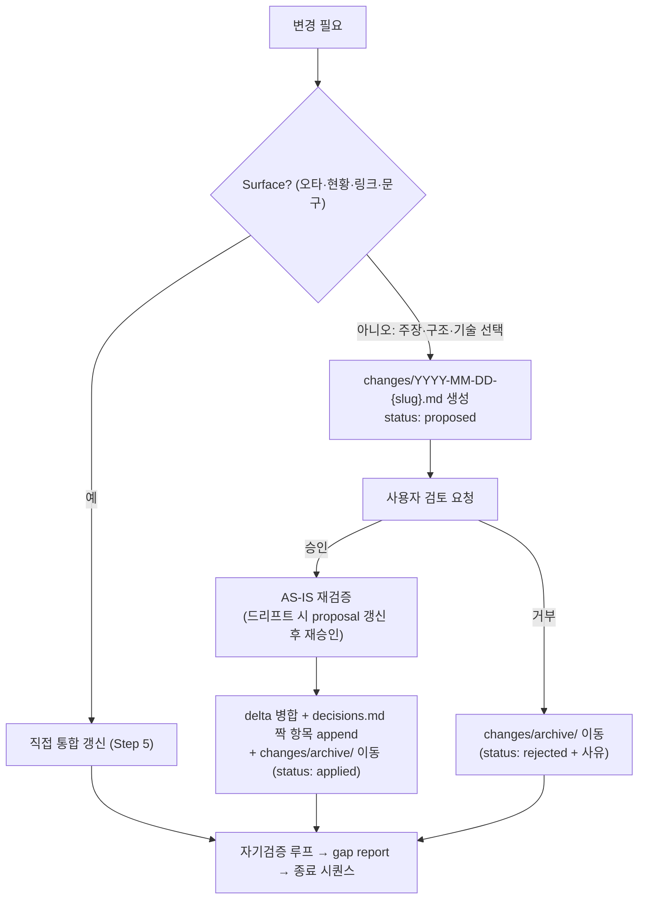

# wiki-project-design

## 개요
Change proposal을 경유해 프로젝트의 design 문서 — `architecture.md` / `domain.md` / `conventions.md` — 를 생성·진화시킨다. 증거는 `knowledge/`·`summaries/`에서 끌어오고, 의미가 바뀌는 변경은 반드시 `changes/`를 거쳐 병합한다.

## 언제 사용
- **트리거:** "아키텍처 잡자", "설계 업데이트", "도메인 용어·규칙 정리", "비즈니스 로직 정리", "이 결정 설계에 반영", `/wiki-project-design`.
- **경계 — 이 스킬이 쓰지 않는 것:**
  - `overview.md`/`context.md`/`goals.md` → **읽기만(R)**. 목적·KPI·제약이 바뀌면 `wiki-project-init`(재프레이밍) 또는 `wiki-project-record`(decisions.md)로 안내한다.
  - `decisions.md` → applied proposal의 **짝 항목만** 직접 append한다(아래 참조). design과 무관한 결정(외주·일정·예산 등)은 `wiki-project-record`로 안내한다.
  - `backlog.md`/`troubleshooting/`/`meetings/` → **읽기만(R)**. 기록은 `wiki-project-record` 소관.

## 변경 유형 판별 — Surface vs Semantic (결정적 분기)
- ✅ **Surface** (오타, 현황 숫자, 링크 보수, 표현 다듬기) → change proposal 생략, 바로 통합 갱신.
- ❌ **Semantic** (주장·구조·기술 선택이 바뀜) → **change proposal 필수. design 문서의 의미를 절대 직접 편집하지 않는다.** 1인 사용자라도 AS-IS→TO-BE와 결정 흔적이 history로 남아야 다음 프로젝트 설계의 재료가 된다.

## 워크플로우
0. **Config Gate** (AGENTS.md / CLAUDE.md Step 0).
0.5. `hot.md` 읽기 — 관련 논의 스레드 확인.
1. 대상 문서 + 변경 유형(Surface/Semantic) 식별. Surface → Step 5로 직행. Semantic → Step 2로.
2. **재료 수집.**
   - 대화에서 요구·제약·기술 선택 수집(기존 프로젝트를 역방향으로 문서화하는 경우, 대화 컨텍스트에 담긴 **코드 분석 결과 포함** — 코드를 직접 읽어 역추출하지 않는다, Phase 2 `wiki-project-sync` 영역).
   - wiki-query로 `knowledge/`·`summaries/` 근거 검색 — **architecture 작업에는 필수 실행**. 매치 있으면 `(출처: [[...]])` 인용, 없으면 `⚠️ unverified` + gap report에 missing knowledge 기록.
   - `changes/archive/`에서 같은 주제의 이전 이력 확인(재변경 여부 파악).
   - 논의 중 **프로젝트 무관·일반화 가능한 통찰**이 나오면 domain.md/architecture.md에 쓰지 않고 `wiki-knowledge` 승격을 제안한다(공통 원칙 4).
3. change proposal 작성(`status: proposed`, 아래 제안 템플릿) → 사용자 검토 요청.
4. **(Semantic 경로) 사용자 응답 분기.**
   - **승인** → 대상 문서를 다시 읽어 AS-IS가 여전히 현재 내용과 일치하는지 재검증한다(저장된 체크섬이 아니라 본문 재확인) — 드리프트했으면 proposal을 갱신하고 재승인받는다. 이후 delta 병합(통합, append 아님) → `decisions.md` 짝 항목 직접 append(§4-9-3 포맷, `변경 기록: [[changes/archive/YYYY-MM-DD-{slug}]]`을 최종 archive 경로로 기입) → proposal을 `changes/archive/`로 이동(`status: applied`, `status_changed` 갱신) → Step 6으로.
   - **거부** → `changes/archive/`로 이동(`status: rejected` + 사유, `status_changed` 갱신) → Step 6으로. 거부도 design history다.
5. **(Surface 전용)** 직접 통합 갱신 실행(append 금지). `domain.md`의 일반 개념은 본문 복제 없이 `[[knowledge]]` 링크로.
6. 자기 검증 체크리스트 루프 — 아래 품질 체크 기준으로 최대 2회 반복, 잔여 항목은 보고.
7. Gap report 출력 — missing knowledge 목록 포함.
8. 종료 시퀀스 — index → log → hot → QMD refresh(§3-5). log: `[YYYY-MM-DD] PROJECT-DESIGN name="…" change="{slug}|surface" files=[…]`.

## Change-proposal 규약



- **changes/ QMD 인덱싱:** proposed도 전체 인덱싱한다(별도 제외 없음). 대신 `base_confidence: 0.3`(전체 소스 유형 중 최저) + `tier: peripheral`로 wiki-query 랭킹에서 자연 강등시킨다. proposed 인용 시 "(proposed — 미확정 설계)" 표시 책임은 이 스킬이 아니라 wiki-query 출력 규칙(§4-5)에 있다 — design 단독으로는 보장하지 못한다.
- **링크 안정성 (MUST):** proposal을 참조하는 링크는 생성 시점부터 최종 archive 경로로 쓴다 — `변경 기록: [[changes/archive/YYYY-MM-DD-{slug}]]`. `changes/` → `archive/` 이동 후에도 링크가 끊기지 않게 하기 위한 **유일한 예외적 folder-qualified 표기**다(그 외 모든 링크는 `[[slug]]`).
- **다중 파일 실패 처리:** proposal 생성·delta 병합·decisions append·archive 이동·index/log/QMD는 하나의 트랜잭션이 아니다(§3-6 — 전용 스테이징 없음, idempotent 재실행으로 완료분은 스킵). 중간 실패는 wiki-lint 체크 16(change proposal 무결성)이 방치된 proposed·미-archive·누락된 decisions 링크를 감지·수리한다. git이 롤백을 대신한다.
- **decisions.md 공동 작성 경계:** design을 바꾸는 결정의 `decisions.md` 짝 항목은 이 스킬이 §4-9-3 포맷을 **직접** append한다(형식 단일 출처=record, 위임 호출 없음). design과 무관한 결정은 `wiki-project-record`로 넘긴다. 구별 기준: `변경 기록:` 줄의 존재 여부(design 경유 ⟺ 존재).

### 제안 템플릿
frontmatter는 §3-3 문서 클래스 ②(축소셋 — `tags`·`sources`·`updated` 불필요).

```markdown
---
title: "{변경 한 줄 제목}"
category: projects
project: "{name}"
targets: ["architecture.md"]
status: proposed   # proposed | applied | rejected
created: YYYY-MM-DD
status_changed: YYYY-MM-DD
summary: "≤400자"
base_confidence: 0.3   # 전체 소스 유형 중 최저 — proposed는 미확정 설계
tier: peripheral       # wiki-query 랭킹 최하위
---

## 동기
[왜 이 변경이 필요한가]

## Delta
### MODIFIED: architecture.md › 컨테이너 (C4 L2)
**AS-IS**: [현재 내용 요약/인용]
**TO-BE**: [변경 후 내용]

### ADDED: architecture.md › 기술 스택 결정 근거
[추가 내용]

### REMOVED: domain.md › {용어}
[제거 사유]

## 근거
[(출처: [[knowledge-페이지]]) 인용. 없으면 ⚠️ unverified + missing knowledge 기록]

## 영향
[영향받는 페이지 [[링크]], 후속 작업, 깨질 수 있는 것]
```

## 문서 구조
- **architecture.md** — 권장 섹션(빈 상태로 강제 작성 금지): `## 시스템 컨텍스트 (C4 L1)` / `## 컨테이너 (C4 L2)` (둘 다 그릴 가치가 있을 때 mermaid 권장 — `references/mermaid-conventions.md` 준수) / `## 핵심 컴포넌트 (C4 L3)`(복잡한 부분만 on-demand) / `## 기술 스택 결정 근거`(`(출처: [[knowledge]])` + `[[decisions]]`).
- **domain.md** — 단순 용어집이 아니라 프로젝트의 도메인 모델: `## 용어집`(유비쿼터스 언어) / `## 도메인 규칙·불변식`(항상 참인 제약) / `## 비즈니스 로직`(상태 전이·계산·정책 — 코드는 간단한 예시만, **코드베이스 역추출 절대 금지**, Phase 2 영역). 일반 개념은 본문 복제 없이 `[[knowledge]]` 링크. `summary` 400자 또는 본문 2화면 초과 시 `domain/{bc}.md`로 **bounded-context별 분할**(`domain/index.md` = BC 목록 + 공통 용어·규칙; §3-6 순서 — 신규 페이지 먼저·index 나중).
- **conventions.md** — 부차적, 로직 우선. 합의된 코드 컨벤션을 논리적으로 서술하고 코드는 간단한 예시로만 첨부한다(자동 추출·linter 연동 없음 — Phase 2 영역). 코드 프로젝트가 아니면 생략.
- **다이어그램 정책:** 권장 + on-demand(의무 아님) — 그릴 가치가 있을 때만 작성, 빈 다이어그램 강제 금지. 다이어그램의 의미 변경도 semantic 변경이므로 change proposal 대상이다. 문법·표기 단일 출처는 `references/mermaid-conventions.md`.

## 품질 체크
의미 변경에 change proposal 존재(표면 변경만 직접 갱신) · applied proposal마다 decisions.md 항목 + `[[change]]` 링크(스냅샷-기록 짝) · AS-IS/TO-BE가 구체적(요약이 아니라 비교 가능한 수준) · 기술 주장에 `(출처: [[...]])` 또는 `⚠️ unverified` + missing knowledge 기록 · domain.md에 일반 개념 본문 복제 없음(`[[knowledge]]` 링크) · 다이어그램은 mermaid-conventions.md 준수 · index.md 등록·log.md 기록·hot.md 갱신·QMD refresh(§3-5) 완료.
