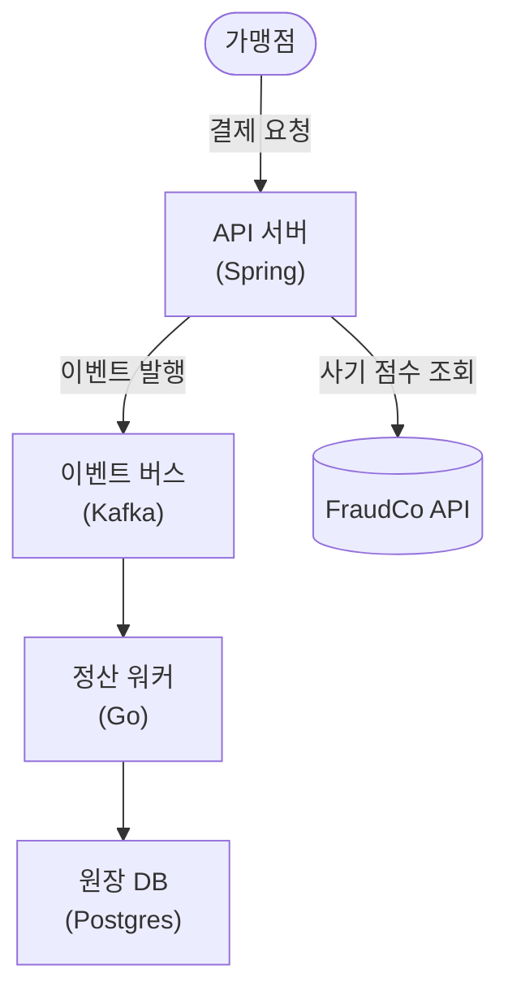

# Mermaid C4 Conventions (wiki-project-design)

Obsidian renders Mermaid natively. Use it for **C4 L1 (system context)** and **L2 (containers)** when a diagram earns its place — never force an empty diagram. L3 (components) only for genuinely complex parts. A diagram's *meaning* change is a semantic change → goes through a `changes/` proposal like any design edit.

## Syntax subset
Use `flowchart TD` (or `LR`). Avoid exotic node shapes/plugins — keep it portable.

## C4 notation as flowchart
- **Person / external actor:** `actor([사용자])`
- **System under design (L1):** `sys[["결제 게이트웨이"]]`
- **External system (L1):** `ext[(FraudCo API)]`
- **Container (L2):** `c["API 서버 (Spring)"]` — label name + technology in parentheses.
- **Relationship:** `a -->|"카드 결제 요청"| b` — always label the edge with the interaction.

## Naming
- Node ids: short lowercase (`api`, `db`, `queue`) — semantic, not `n1`/`box2`.
- Node labels: the real domain/container name; put tech stack in `()`.
- One diagram per C4 level; don't mix levels in one graph.

## Example (L2 container view)

Keep diagrams small; if a level needs more than ~10 nodes, split by sub-domain.
