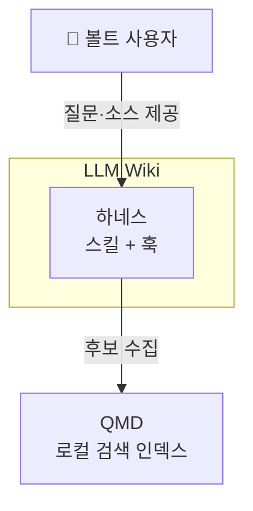
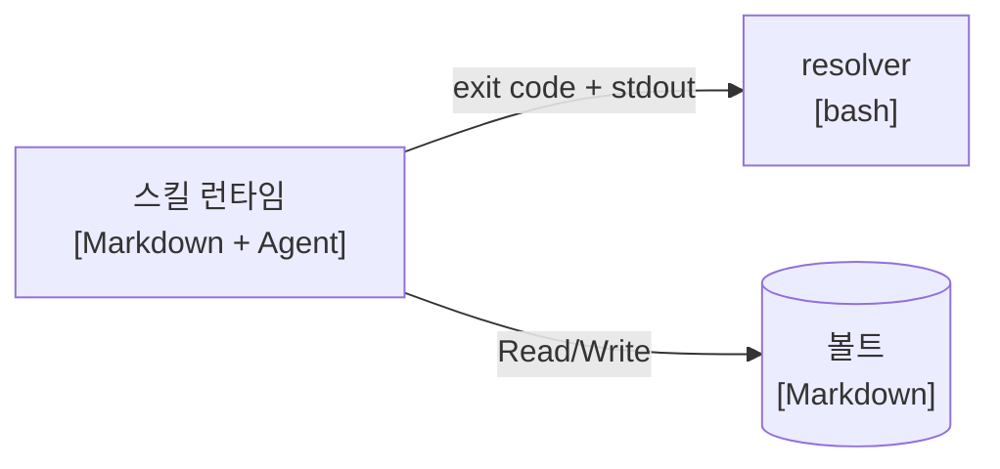
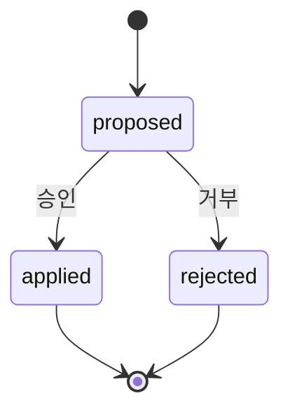

# Mermaid 다이어그램 규칙 — C4 표기

`architecture.md`·`domain.md`의 다이어그램은 이 규칙을 따른다. 목적은 프로젝트가 여러 개로 늘어나도 다이어그램이 **같은 어휘로 읽히게** 하는 것이다.

다이어그램은 **권장이지 의무가 아니다.** 그릴 가치가 있을 때만 그린다 — 노드 3개짜리 빈 다이어그램은 산문 한 줄보다 정보가 적다.

## 공통

- Obsidian 네이티브 렌더링을 전제로 ` ```mermaid ` 코드펜스에 넣는다. 별도 플러그인 문법(C4 전용 DSL 등)은 쓰지 않는다 — 렌더링 보장이 없다.
- **레이아웃 선언은 `flowchart`를 쓴다** (`graph`는 레거시 키워드).
- 방향은 `flowchart TB`(위→아래) 기본, 좌우 흐름이 자연스러운 경우만 `LR`.
- **노드 ID는 영문 kebab 없는 소문자·언더스코어**(`api_gateway`), **표시 라벨은 한국어**를 큰따옴표로 감싼다: `api_gateway["API 게이트웨이"]`. ID에 한글·공백·하이픈을 쓰면 파서가 깨진다.
- 라벨에 `(`, `)`, `:`, `,`가 들어가면 반드시 따옴표로 감싼다.
- 다이어그램 아래에 **한 줄 캡션**을 둔다 — 다이어그램이 렌더되지 않는 환경(grep·QMD·터미널)에서 유일한 정보원이다.
- 다이어그램은 산문을 대체하지 않는다. 결정의 **이유**는 항상 본문 텍스트에 남는다.

## C4 L1 — 시스템 컨텍스트

우리 시스템 1개 + 사람 + 외부 시스템. **내부 구조는 그리지 않는다.**

- 사람: `person_{역할}`, 라벨 앞에 `👤`
- 우리 시스템: `system_{name}` — `subgraph`로 경계를 표시
- 외부 시스템: `ext_{name}`
- 엣지 라벨에 상호작용의 성격을 쓴다 (`-->|"요약 조회"|`)

````markdown

*L1 — 사용자는 하네스와만 대화하고, QMD는 선택적 외부 인덱스다.*
````

## C4 L2 — 컨테이너

배포·실행 단위와 기술 스택. 노드 라벨 둘째 줄에 기술을 적는다.

- 컨테이너: `c_{name}`, 라벨 = `이름<br/>[기술]`
- 데이터 저장소는 `[(...)]` 실린더 형태
- 컨테이너 간 엣지에 **프로토콜·형식**을 명시한다

````markdown

*L2 — 스킬은 resolver의 출력 인터페이스에만 의존한다.*
````

## C4 L3 — 컴포넌트

**복잡한 부분만 on-demand.** 컨테이너 1개를 골라 그 내부만 그린다. 접두사 `cmp_`. 한 다이어그램에 컨테이너 두 개를 섞지 않는다.

## 도메인 다이어그램

`domain.md`에서 규칙을 그림으로 보이는 것이 더 짧을 때만 쓴다.

- **상태 전이** → `stateDiagram-v2`. 전이 라벨 = 도메인 이벤트 이름 (구현 함수명이 아니다).
- **엔티티 관계** → `erDiagram`. 카디널리티를 반드시 표기한다.
- 다이어그램에 나온 용어는 **전부 용어집에 있어야 한다** — 그림에만 존재하는 용어를 만들지 않는다.

````markdown

*change proposal 라이프사이클 — applied·rejected는 종단 상태이고 이후 불변이다.*
````

## 유지보수

- 다이어그램의 **의미 변경은 change proposal 대상**이다. Delta에 `MODIFIED: architecture.md › 컨테이너 (C4 L2)`로 적고 AS-IS/TO-BE에 변경된 노드·엣지를 명시한다.
- 노드가 15개를 넘으면 레벨을 잘못 고른 신호다 — 상위 레벨로 묶거나 L3로 쪼갠다.
