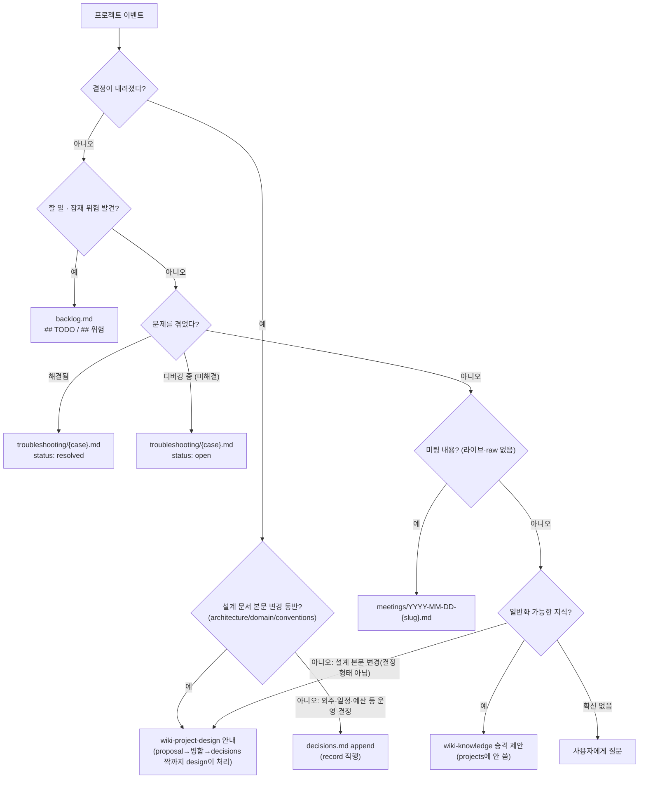

# wiki-project-record

## 개요
결정 · 트러블슈팅 · 미팅 · 백로그를 `projects/{name}/`의 올바른 파일로 라우팅해 기록한다. "불변 로거"가 아니라 **라우팅 싱크(routing sink)** — 관통하는 특성은 *route-then-record*이며, 불변성은 파일마다 다르다.

## 언제 사용
- **트리거:** "이거 결정으로 기록", "트러블슈팅 남겨줘", "할 일/위험 백로그에 추가", "미팅 내용 프로젝트에 정리", 문제 해결 직후, 논의 수렴 시 Claude의 제안, `/wiki-project-record`.
- **경계 — 이 스킬이 쓰지 않는 것:**
  - `overview.md`/`context.md`/`goals.md` → **읽기만(R)**. 목적·KPI·제약 변경은 `wiki-project-init`(재프레이밍)로 안내.
  - `architecture.md`/`domain.md`/`conventions.md` → **읽기만(R), 직접 쓰기 금지(△)**. 경계 기준은 **"설계 문서 본문을 바꾸는가?"** — 예면 `wiki-project-design`으로 안내.
  - `changes/` → **읽기만(R)**. 제안 작성·병합은 `wiki-project-design` 소관.
  - 일반화 가능한(프로젝트 무관) 지식 → `projects/`에 쓰지 않고 `wiki-knowledge` 승격을 제안한다.

## 라우팅
확신 없으면 자동 분류하지 말고 사용자에게 질문한다.



- (raw 트랜스크립트가 있는 미팅은 `wiki-ingest`가 `summaries/meetings/`에 미러링한다. 여기서 다루는 건 raw 없는 라이브 프로젝트 미팅뿐이다.)

**decisions.md 공동 쓰기 — 형식은 record, 쓰기는 두 스킬:** `decisions.md`는 이 스킬이 **소유**(형식·append 규칙의 단일 출처)하지만, 실제 append는 두 스킬이 나눠 한다. 설계 문서 본문 변경을 동반하는 결정은 `wiki-project-design`이 proposal 병합 시 아래 decisions.md 형식을 **직접** append하고(위임 호출 없음), 설계 본문과 무관한 결정만 이 스킬이 직행 append한다. 한 파일에 두 출처가 섞이지만 `변경 기록:` 필드의 유무로 구분된다(design 경유 시만 존재).

## 워크플로우
**Step 0 — Config Gate.**

**Step 0.5 — `hot.md` 읽기.** 관련 논의 스레드 확인.

**Step 1 — 위 라우팅으로 대상 파일 판별.**

**Step 2 — 대화에서 초안 작성**(결정/이유/대안 또는 증상/가설 등, 아래 파일 포맷 준수) → **사용자와 확인**.

**Step 3 — 대상 파일에 append**, 또는 첫 기록이면 신규 파일 생성(케이스당 1파일, 미팅당 1파일).

**Step 4 — 관련 `[[knowledge]]`/`[[concepts]]`/design 문서 링크 연결.**

**Step 5 — 간단한 gap report 출력.** 미기록 결정 후보가 있으면 플래그.

**Step 6 — 종료 시퀀스.** index → log → hot → QMD refresh. log: `[YYYY-MM-DD] PROJECT-RECORD name="{name}" type=decision|troubleshooting|meeting|backlog target="{경로}"`.

## 승인 규칙 — 결정은 사용자의 것
- **MUST** append 전 결정·이유·대안 초안을 제시하고 확인받는다. **자동 append 금지.**
- 논의가 수렴했다고 판단되면 "결정으로 기록할까요?"를 *제안*할 수 있으나, 도장은 항상 사용자가 찍는다.

## 불변성 규칙
파일마다 불변성이 다르다 — 아래 표를 벗어나는 편집은 **위반**이다.

| 파일 | 상태 | 가변 범위 | 불변 범위 |
|---|---|---|---|
| `decisions.md` | 항상 | — (append만) | 전체 항목 본문. 기존 항목 편집 절대 금지 |
| `meetings/YYYY-MM-DD-{slug}.md` | 항상 | — | 전체 본문. 기록 후 불변 |
| `troubleshooting/{case}.md` | `open` | 증상 / 가설·실험 (점진 갱신) | — |
| `troubleshooting/{case}.md` | `resolved` | `## Follow-up`에 새 `[[케이스]]` 링크 추가만 | 증상 / 가설·실험 / 원인·해결·재발방지 (본문 무수정) |
| `backlog.md` | 항상 | 전체 (체크박스 토글, 위험 상태 갱신) | — record의 유일한 완전 가변 산출물 |

- ✅ 결정을 뒤집는다: **새** 항목을 append하고 이전 항목을 참조한다.
- ❌ 기존 `decisions.md` 항목의 본문을 고쳐 쓴다.
- ✅ 문제가 재발한다: 기존 케이스 말미에 `## Follow-up — [[새 케이스]]` 링크만 append한다.
- ❌ `resolved` 케이스의 원인/해결/재발 방지 섹션을 재작성한다. (완전 정정이 필요하면 새 케이스를 만든다.)
- 예외: 본문 항목이 불변이어도 frontmatter 메타데이터(`updated`, `summary` 등) 갱신은 정상 동작이다 — lint의 append-only 검사 대상이 아니다.

## 파일 포맷

**decisions.md 항목** (frontmatter 없음 — 문서 클래스 ③ 원장):
```markdown
## [YYYY-MM-DD] {제목}
- 결정: ...
- 이유: ... (출처: [[knowledge-페이지]] 인용 가능)
- 대안 및 제외 이유: ...
- 변경 기록: [[changes/archive/YYYY-MM-DD-{slug}]]   ← design 경유 시만
```

**backlog.md** (frontmatter 없음 — 문서 클래스 ③ 원장, living):
```markdown
## TODO
- [ ] {할 일} (출처: 코드 분석 | [[페이지]] | 논의) — {한 줄 맥락}
- [x] {완료 항목}

## 위험
- {위험 한 줄} — 영향: {무엇} / 완화: {방안 또는 "미정"} / 상태: open|mitigated|accepted
```

**troubleshooting/{case}.md** (frontmatter = 문서 클래스 ②):
```markdown
---
title: "{사건 한 줄 제목}"
category: projects
status: open | resolved
created: YYYY-MM-DD
updated: YYYY-MM-DD
summary: "≤400자 — 증상·해결 요약"
---
## 증상                      ← open부터 작성
## 가설 / 실험                ← open 동안 점진 갱신
## 원인 / 해결 / 재발 방지      ← resolved 시 채움, 이후 불변
## Follow-up                 ← 재발 시 [[새 케이스]] 링크만 append (본문 무수정)
```

## 품질 체크
append 전 사용자 확인 완료 · 기존 항목 본문 무수정(decisions / resolved troubleshooting / meetings는 diff가 append뿐; backlog·open troubleshooting은 가변 예외) · decisions 이유에 `(출처: [[...]])` 또는 `⚠️ unverified` · troubleshooting: resolved는 4섹션(증상/원인/해결/재발 방지) 완비, open은 증상/가설/실험 · backlog 항목에 출처(코드 분석·논의) 명시 · index.md 등록·log.md 기록·hot.md 갱신·QMD refresh 완료.
